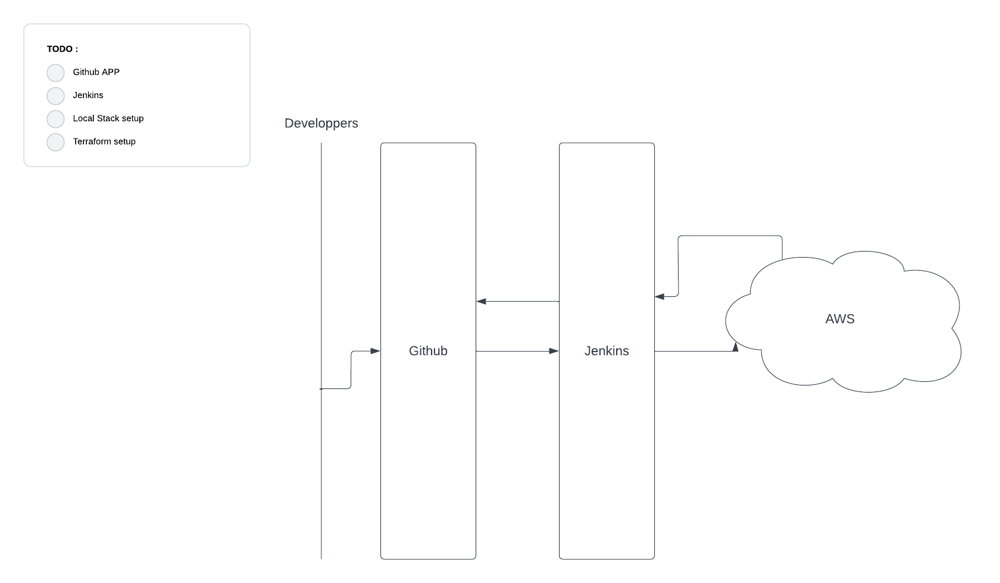

# CiEpitech

Le projet consiste en la mise en place d'une infrastructure cloud aliant les technos Terraform (Pour concevoir l'infra), Local Stack (En Provider) et entierrement gere par une instance Jenkins. Avec comme but de tester l'integration continue.


## Project Workflow



Ce projet sera repartie en 4 grandes etapes :

- [ ] Creation d'un projet sur github

- [ ] Mise en place d'un conteneur docker avec une instance Jenkins ayant un acces complet au repo

- [ ] Configurer terraform - Mise en place de l'infrastructure virtuelle

- [ ] Connecter le tout a Local Stack

## Tech Stack

- **Docker**
- **Terraform**
- **Jenkins**
- **AWS**
- **Local Stack**
- **Node**

## Langage utilise

- **GO**
- **Terraform**

## Requirements

You'll need to install **docker** before getting started
    
## Run Locally

Clone the project

```bash
  git clone https://github.com/Hy0g0/CiEpitech
```

Go to the project directory

```bash
  cd CiEpitech
```

Start the server using docker

```bash
  docker compose up
```


## Authors

- [@Hugo Vicent](https://github.com/Hy0g0)
- [@Alain Victor](https://github.com/avictor22)

